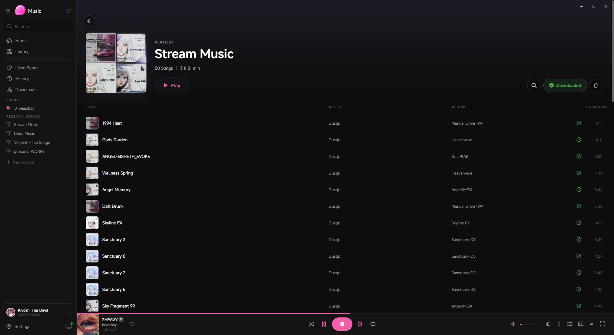

<div align="center">
  
  <h1>Kiyoshi Music</h1>
  <p>An unofficial YouTube Music desktop client — built with Tauri 2 &amp; React.</p>

  [](https://github.com/KiyoshiTheDevil/kiyoshi-music/releases/latest)
  [](https://github.com/KiyoshiTheDevil/kiyoshi-music/releases/latest)
  [](#)
  [](https://tauri.app)
  [](https://crowdin.com/project/kiyoshi-music)
  [](#disclaimer)
</div>

---

<div align="center">
  
</div>

---

## Features

**Playback**
- Full YouTube Music playback with queue management
- Crossfade between tracks
- Adjustable volume with persistent state
- Keyboard shortcuts for all playback controls

**Library & Discovery**
- Browse your YouTube Music library, playlists, albums and artists
- Home feed, charts and recommendations
- Search with instant results
- Offline mode indicator

**Lyrics**
- Synced and static lyrics
- Romaji transliteration for Japanese tracks
- Translation support
- Multiple lyrics provider fallback

**Visuals & Themes**
- Dark theme with customisable accent colour
- Ambient visualizer behind the player
- Custom font selection and UI zoom
- High contrast accessibility mode

**OBS / Streaming Overlay**
- Built-in Now-Playing widget server — point your OBS browser source at `http://localhost:9847/overlay`
- Fully configurable via in-app settings: background, blur, border, shadow, typography, art size
- Per-corner style — mix rounded and beveled corners independently on both the widget frame and album art
- Save, load, export and import custom overlay profiles

**Integrations**
- Discord Rich Presence
- System tray with media controls
- Auto-updater with in-app changelog

**Other**
- Google account optional — log in only if you want library sync
- German & English UI, more languages via [Crowdin](https://crowdin.com/project/kiyoshi-music)

---

## Screenshots

| Home | Lyrics | Playlist |
|:----:|:------:|:--------:|
|  |  |  |

---

## Download

Head to the [**Releases**](https://github.com/KiyoshiTheDevil/kiyoshi-music/releases/latest) page and grab the latest Windows installer (`.exe`).

> **Linux:** AppImage and `.deb` builds are provided but not the primary focus. They may require additional attention and are not guaranteed to be fully stable.

> **Google Account:** Not required to use the app. Only needed if you want to sync your YouTube Music library and playlists.

---

## Help Translate

Want Kiyoshi Music in your language?  
Join the translation effort on **[Crowdin](https://crowdin.com/project/kiyoshi-music)** — every contribution helps! (⁠≧⁠▽⁠≦⁠)

---

## Known Issues

| Issue | Status |
|---|---|
| Performance issues | ✅ Fixed |
| Higher RAM usage sometimes | ✅ Fixed |
| Some animations ignore the "Disable Animations" setting | 🔧 In progress |

Found a bug? Please report it in the [**Issues**](https://github.com/KiyoshiTheDevil/kiyoshi-music/issues) tab — thank you!

---

## For Developers

### Prerequisites

- [Node.js](https://nodejs.org/) v18+
- [Rust](https://rustup.rs/) (stable)
- [Python](https://www.python.org/) 3.10+

### Setup

```bash
# 1. Clone
git clone https://github.com/KiyoshiTheDevil/kiyoshi-music.git
cd kiyoshi-music

# 2. Frontend dependencies
npm install

# 3. Python backend dependencies
cd python-backend
pip install -r requirements.txt
cd ..

# 4. (Optional) Authenticate with your YouTube account
cd python-backend
python setup_auth.py
cd ..
```

### Run in development mode

```bash
npm run tauri dev
```

### Build

```bash
npm run tauri build
```

---

## Changelog

See [CHANGELOG.md](CHANGELOG.md) for a full version history.

---

## Disclaimer

Kiyoshi Music is an unofficial client and is not affiliated with or endorsed by YouTube or Google.  
It uses the unofficial YouTube Music API for personal use only. Use at your own risk.
