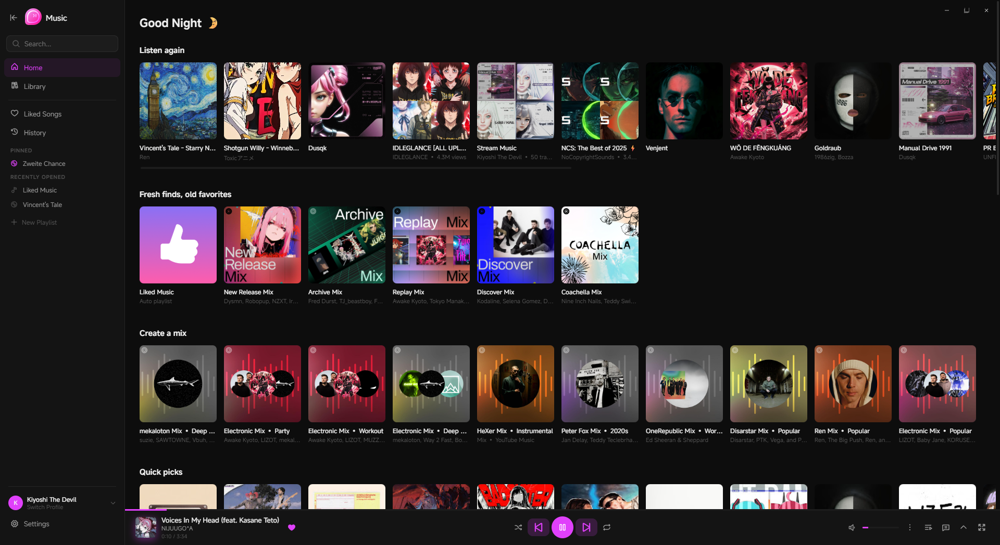
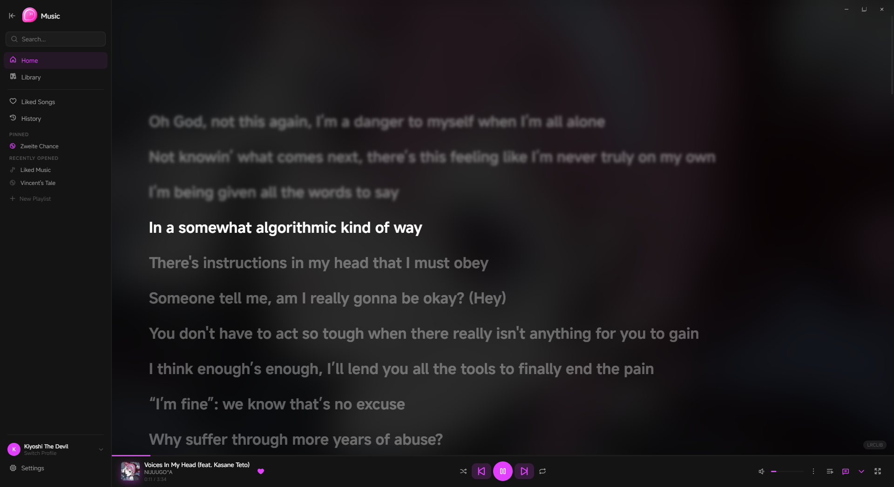
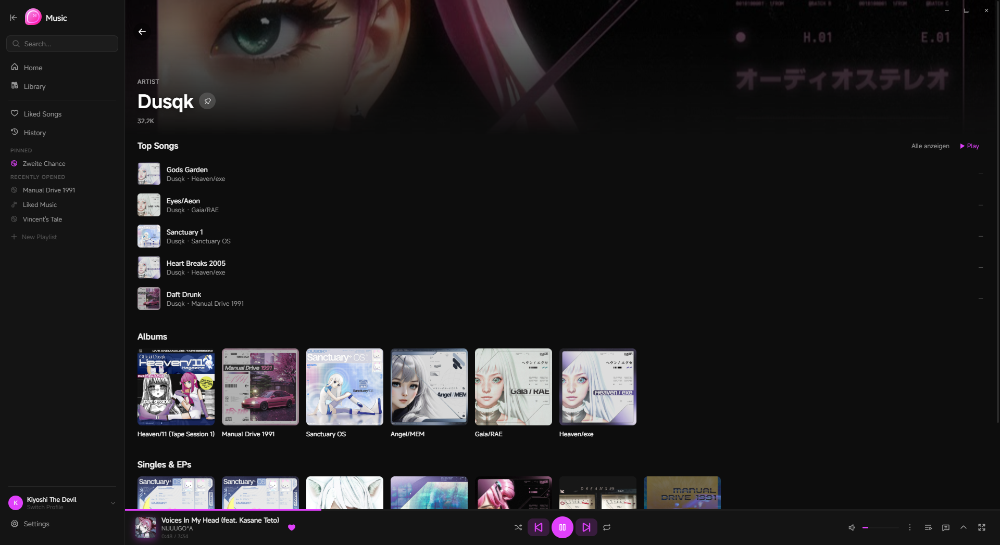

<div align="center">
  
  <h1>Kiyoshi Music</h1>
  <p>An unofficial YouTube Music desktop client for Windows, built with Tauri 2 + React.</p>

  
  
  
  
</div>

---

<div align="center">
  
</div>

<br>

<div align="center">
  
  
</div>

---

## Features

| Feature | Status |
|---|---|
| Home feed (Mixes, Quick Picks, Listen Again) | ✅ Available |
| Library & Playlist management | ✅ Available |
| Liked Songs & History | ✅ Available |
| Global Search | ✅ Available |
| Artist & Album pages | ✅ Available |
| Playback controls (Shuffle, Repeat, Queue) | ✅ Available |
| Synced Lyrics (Line & Syllable sync) | ✅ Available |
| Multiple lyrics providers (LRCLIB, BetterLyrics, SimpMusic, Kugou) | ✅ Available |
| Explicit content filter | ✅ Available |
| In-playlist search & total duration | ✅ Available |
| UI scaling | ✅ Available |
| Multilingual UI (English & German) | ✅ Available |
| Keyboard shortcuts | ✅ Available |
| Visualizer | 🔜 Planned |
| Romaji toggle for Japanese titles | 🔜 Planned |
| Close to tray | 🔜 Planned |
| Open on startup | 🔜 Planned |
| High contrast mode | 🔜 Planned |
| Community translations (Crowdin) | 🔜 Planned |
| WebNowPlaying support | 🔜 Planned |

---

## Download

Head over to the [Releases](https://github.com/KiyoshiTheDevil/kiyoshi-music/releases) page and download the latest installer.

---

## For Developers

### Prerequisites

- [Node.js](https://nodejs.org/) (v18+)
- [Rust](https://rustup.rs/)
- [Python](https://www.python.org/) (3.10+)

### Setup

```bash
# 1. Clone the repository
git clone https://github.com/KiyoshiTheDevil/kiyoshi-music.git
cd kiyoshi-music

# 2. Install Node dependencies
npm install

# 3. Install Python dependencies
cd python-backend
pip install -r requirements.txt
cd ..

# 4. Authenticate with your YouTube account
cd python-backend
python setup_auth.py
cd ..
```

### Run in development mode

```bash
npm run tauri dev
```

### Build

```bash
npm run tauri build
```

---

## Disclaimer

Kiyoshi Music is an unofficial client and is not affiliated with or endorsed by YouTube or Google.
It uses the unofficial YouTube Music API for personal use only. Use at your own risk.
